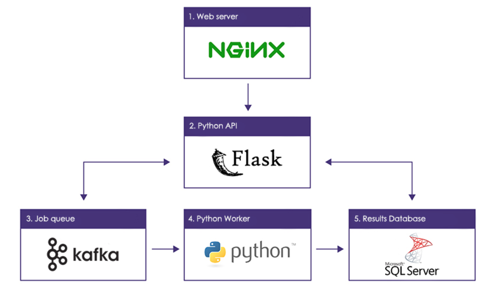

### NGINX - GUNICORN - FLASK
This an example configuration for using Nginx + Gunicorn to serve up a flask application.


### Setting up python environment
The following shows how to setup an environment and assumes knowledge of bash / RHEL.  The following has been tested on `RHEL 6.8 (Santiago)` and assumes you are starting on a fresh OS install (i.e. it is not assumed you have any of these dependencies already installed).

Let's create some bash variables to get started. Here we assuming that the flask application will be installed into `/opt/apps` directory, the Python environment will be named `myenv` and we are manually setting the `PATH` variable to include this environment.  This manual setting of the `PATH` variable is not necessary if you already have an environment and activated it using `source activate myenv`. 
```bash
APPS_DIR=/opt/apps
PYTHON_ENV=myenv
PATH=/usr/local/envs/$PYTHON_ENV/bin:/usr/local/bin:$PATH
```

##### Install conda & create Python environment
The following code block installs conda into the `/usr/local` directory.  Conda is used to create an isolated Python environment and to install 3rd-party dependencies (e.g. numpy, scipy).
```bash
curl -sSL https://repo.continuum.io/miniconda/Miniconda2-latest-Linux-x86_64.sh -o /tmp/miniconda.sh
bash /tmp/miniconda.sh -bfp /usr/local
rm -rf /tmp/miniconda.sh
conda clean --all --yes
conda update conda
conda config --add channels conda-forge 
conda config --set always_yes yes --set changeps1 no
conda create -n $PYTHON_ENV python=2.7
source activate $PYTHON_ENV
```

##### Install additional dependencies and copy code into app directory
here we are using `conda` to install necessary dependencies including `flask`, `gunicorn`, `gevent`(for async workers), `pytest`, `flask-restful`, `flask`-cors`
```bash
conda install flask -y
conda install gunicorn -y
conda install gevent -y
conda install pytest -y
conda install celery
pip install flask-restful
pip install flask-cors
git clone <this-repo> $APPS_DIR
cd $APPS_DIR && python setup.py install
```

##### Supervisor will be run as a service and will monitor the `gunicorn` daemons
```bash
pip install supervisor
sudo mkdir -p /etc/supervisor
sudo cp $APPS_DIR/devops/supervisord.conf /etc/supervisor/
sudo cp $APPS_DIR/devops/gunicorn_supervisor.ini /etc/supervisor/
sudo cp $APPS_DIR/devops/supervisord.sh /etc/rc.d/init.d/supervisord
sudo chmod +x /etc/rc.d/init.d/supervisord
sudo service supervisord start
sudo chkconfig --add supervisord
```

##### Install and configure Nginx
Supervisor will be run as a service and will monitor the `gunicorn` daemons. 
```bash
sudo rpm -U --quiet http://nginx.org/packages/centos/6/noarch/RPMS/nginx-release-centos-6-0.el6.ngx.noarch.rpm
sudo yum -y install nginx
sudo service nginx stop
sudo mv /etc/nginx/nginx.conf /etc/nginx/nginx.conf-orig
sudo cp $APPS_DIR/devops/nginx.conf /etc/nginx/
sudo service nginx start
```

##### Additional setup considerations:
Some of the default settings in gunicorn may require tweaking.  These include:

- `gunicorn.conf.py` -> `max_requests`: this variable controls how many requests are served by a single gunicorn worker until the worker restarts.  If you are starting any background threads within the flask worker code, you should set this value to `0` so gunicorn doesn't restart the worker and kill your threads
- `gunicorn.conf.py` -> `timeout`:  If you have a long-running, request (>10s), then you will need to make sure gunicorn doesn't timeout your worker and kill the process.
- `gunicorn.conf.py` -> `workers`:  This is number of workers gunicorn will run.  If running on a dedicated machine, this number should be set to `NUM_CORES * 2 + 1`.  If on a shared machine, you will need to make a judgement call about how many workers to run based on competing resource needs. 
- `gunicorn.conf.py` -> `worker_class`: This is the type of worker to run (`sync` vs. `async` / `gevent`).  When running background threads within gunicorn workers, it seems like running `sync` workers is necessary.  
- `nginx.conf` -> `proxy_read_timeout`:  If you have a long-running, request (>10s), then you will need to make sure nginx doesn't timeout your worker and kill the process.
- `nginx.conf` -> `proxy_connect_timeout`:  If you have a long-running, request (>10s), then you will need to make sure nginx doesn't timeout your worker and kill the process.


### Administration Commands

- Restart Nginx: `service nginx restart`
- Restart Gunicorn: `service supervisord restart`
- Manually kill gunicorn workers: `killall -s KILL gunicorn`
- Change the number of gunicorn workers:
  - increase by one: `# kill -TTIN $masterpid`
  - decrease by one: `# kill -TTOU $masterpid`


### Docker container

This repo provides a Dockerfile with all the [setup steps](#Setting-up-python-environment) necessary.
The app (*i.e,* this repo) is also there, pre-installed.

To build the container, go to `dockerfile/` dir and run:
```bash
# docker build -t nginx_gunicorn_flask .
```
(notice the period at the end)

Once the container was succesfully built, we can run it with:
```bash
# docker run -it -p 80:80 nginx_gunicorn_flask
```

And you should now be able to see in your (host) browser the service working by visiting `http://localhost`.


##### Running the container with your current repository (sharing host/container directory)
For various reasons, you may want to use your current repository -- *i.e,* the repository in your host system -- to run the app from inside the container.
This can be done by using docker *volumes*.
Say your copy of this repository is in your home, `$HOME/nginx-gunicorn-flask`; And remember the app (or this repo *inside* the container) is at `$APPS_DIR=/opt/apps`.
What we have to do is:

```bash
[host]# docker run -it -v $HOME/nginx-gunicorn-flask:/opt/apps -p 80:80 nginx_gunicorn_flask
```

Then, inside the container, we should just refresh our setup:
```bash
[container]# cd $APPS_DIR
[container]# pip install -e .
```

Restart the daemons:
```bash
[container]# service nginx restart
[container]# service supervisord restart
```

If everything works fine, your (host) browser should answer to `http://localhost`.


------------

### Additional Job Queue Considerations

##### Using Apache Kafka



1. Request requiring long-running job comes in through Nginx over HTTP.

2. Flask authenticates user, create job token, places token / job arguments into Kafka Queue. 

3. Kafka maintains queue of active, successful, and fail jobs

4. Python worker subscribes to Kafka group and receives jobs

5. Results store to MSSQL


